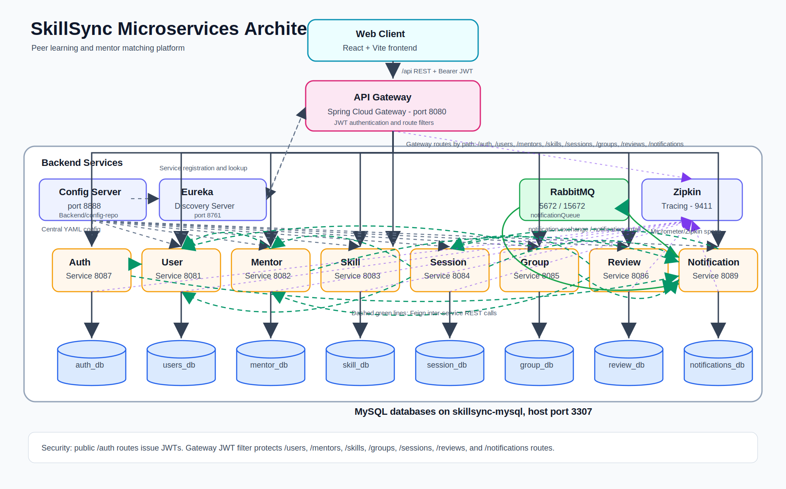
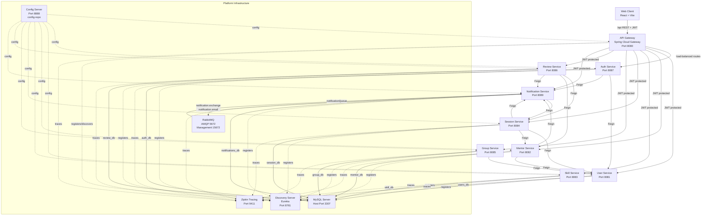
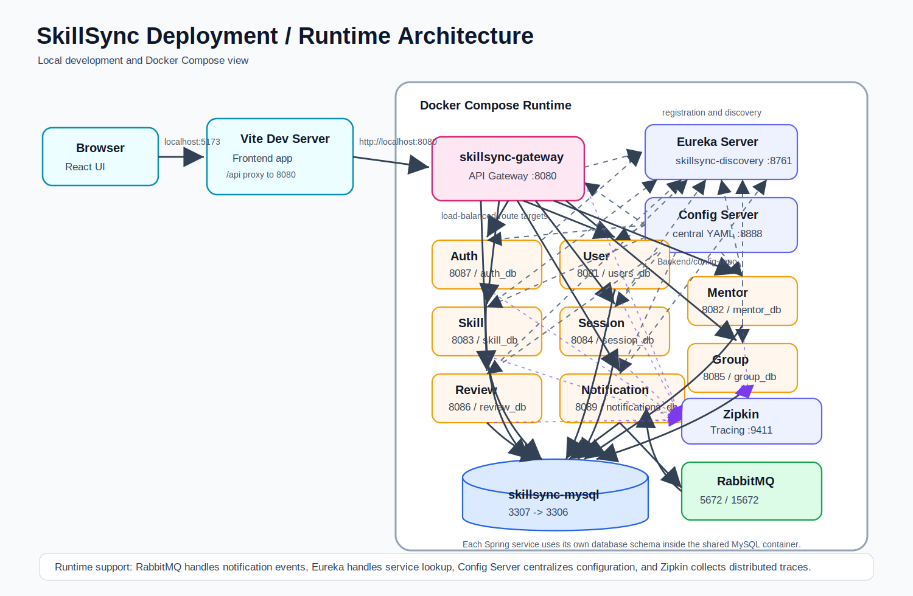
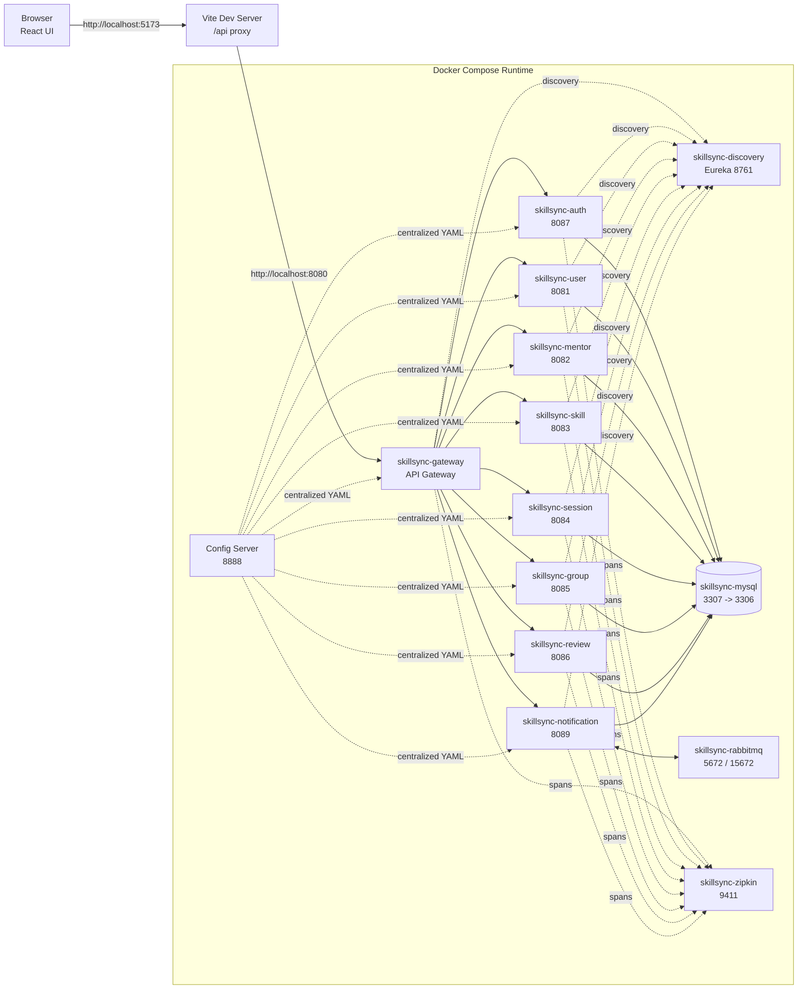

# SkillSync Architecture Diagrams

These diagrams are tailored for the SkillSync peer learning and mentor matching platform.

## 1. Microservices Architecture

Use this diagram when explaining the backend design, service discovery, API gateway routing, databases, and async notification flow.

## 2. Deployment / Runtime Architecture

Use this diagram when explaining how the local system runs through Docker Compose and service ports.

